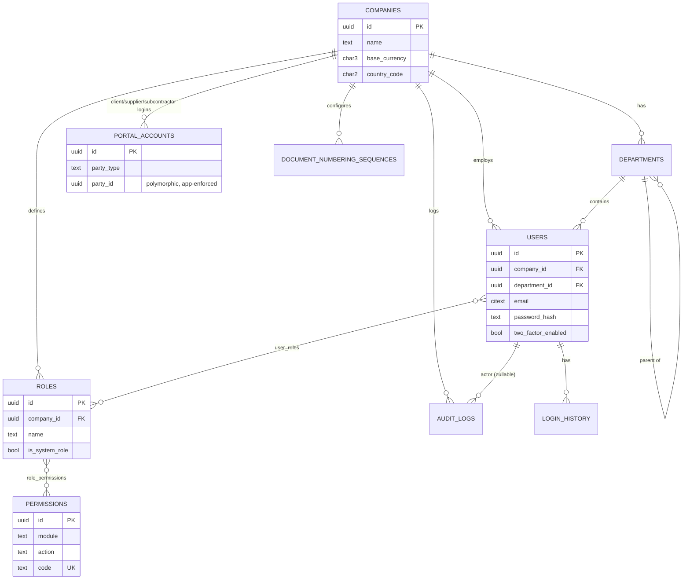
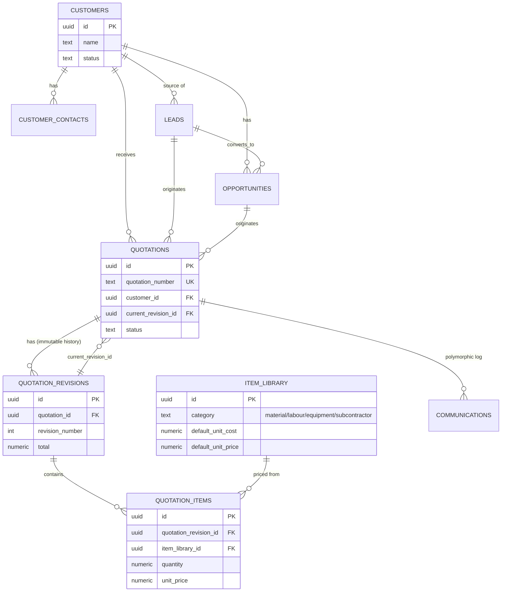
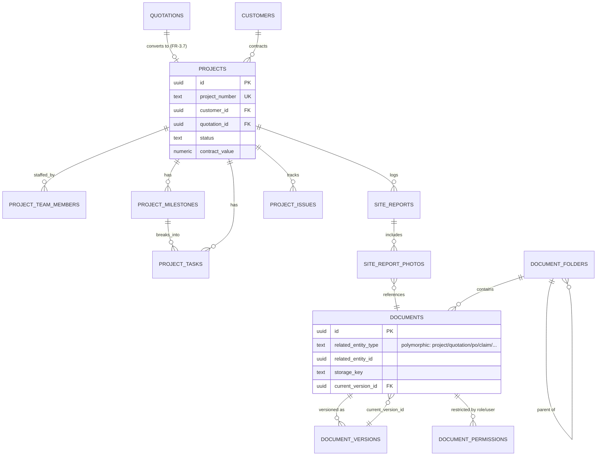
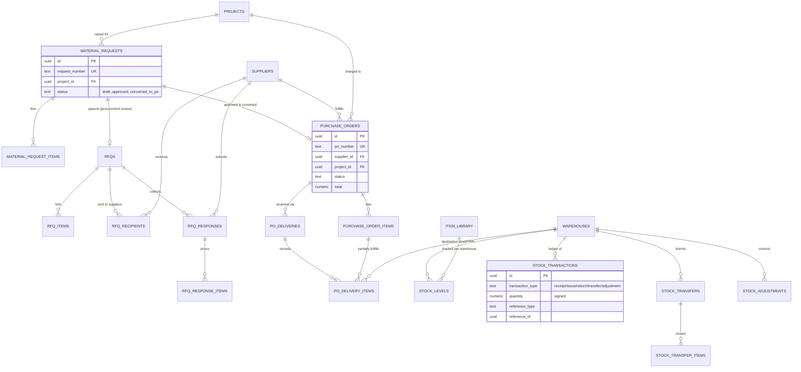
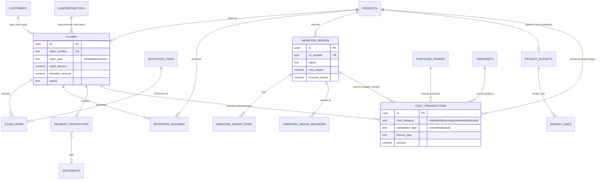
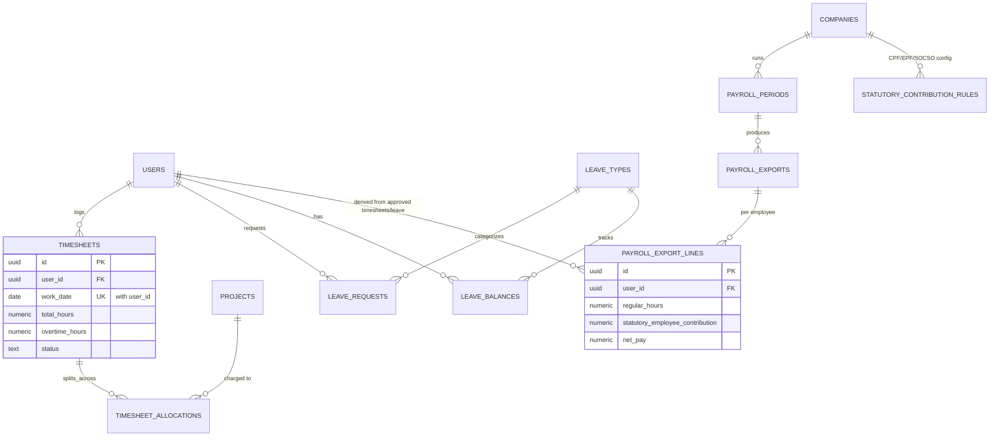
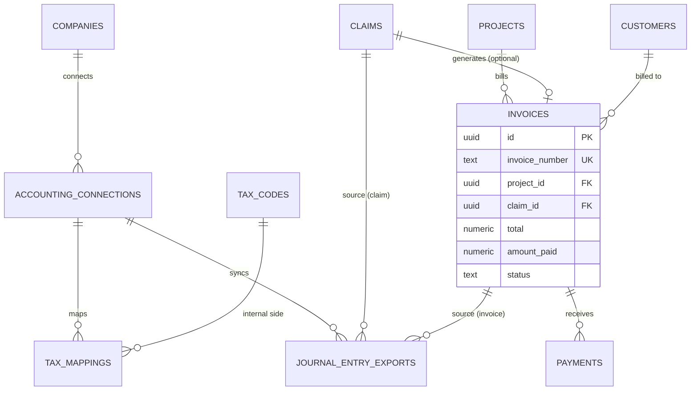
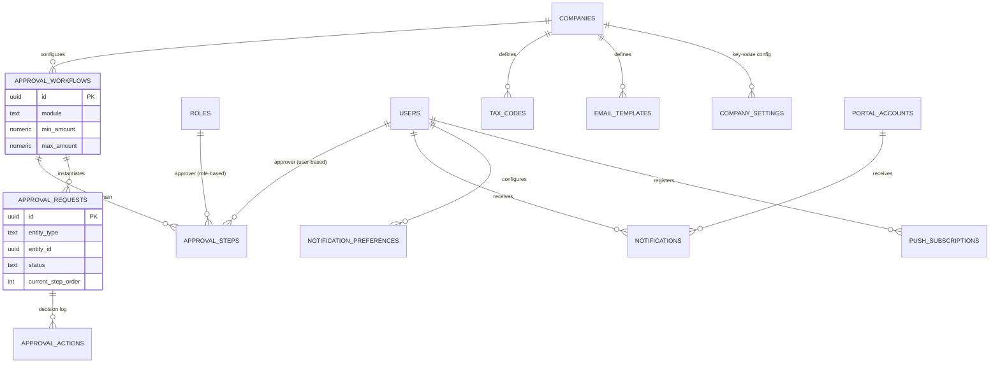

# Entity Relationship Diagrams

Source of truth for exact columns/types/constraints is the SQL in
[`db/migrations/`](../../db/migrations/). These diagrams are grouped by
domain (one giant diagram across ~70 tables would be unreadable) and show
entity relationships with key fields only.

All tenant-scoped tables carry `company_id → companies.id` (omitted below
per-entity for clarity, called out once per diagram).

---

## 1. Core & Identity (RBAC, audit)

---

## 2. CRM & Quotation Management

---

## 3. Projects & Documents

---

## 4. Procurement, Purchase Orders & Inventory

---

## 5. Claims, Variation Orders & Project Costing

---

## 6. Timesheets & Payroll

---

## 7. Accounting Integration, Invoices & Payments

---

## 8. Settings, Approval Workflow Engine & Notifications

`approval_requests.entity_type` / `entity_id` is a polymorphic reference
(app-enforced, no native FK) pointing at whichever record — quotation,
purchase_order, variation_order, claim, timesheet, or leave_request —
triggered the workflow.

---

## Full-Text / Fast Search

`pg_trgm` GIN indexes are applied to the columns most likely to be
searched from a list view: `users.full_name`, `customers.name`,
`suppliers.name`, `projects.name`, `item_library.name`,
`documents.file_name` — satisfying the "fast search" non-functional
requirement (NFR, section 6 of the SRS) without a separate search
engine for V1. If full-text relevance search across free-text bodies
(site reports, communications) becomes necessary later, Postgres
`tsvector` columns or an external index (e.g. OpenSearch) can be added
without changing this schema's shape.
