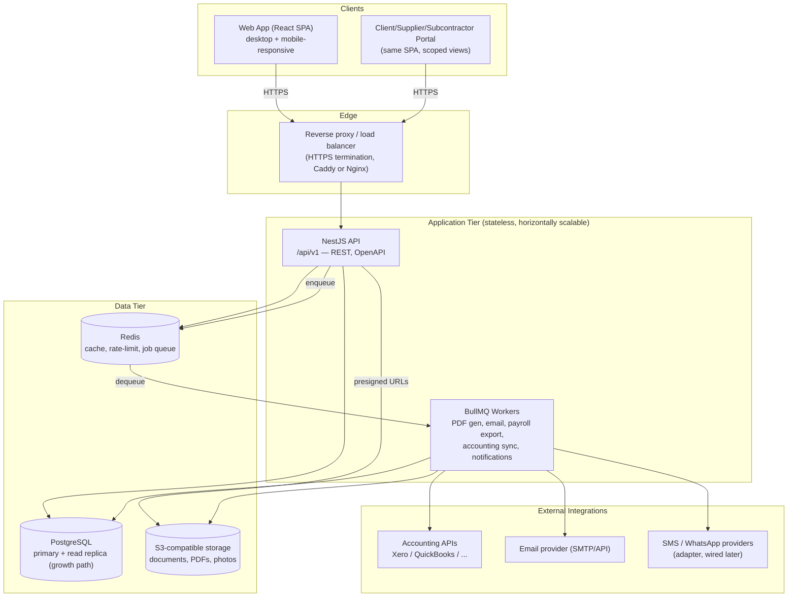

# System Architecture — Overview & Stack Recommendation

**Status:** Phase 3 — proposed for approval. Nothing here is irreversible;
this is the point where a change of direction is cheapest, so push back
on anything before Phase 5 (Backend APIs) starts consuming it.

---

## 1. Technology Stack

| Layer | Choice | Why |
|---|---|---|
| Database | PostgreSQL 15+ | Decided in Phase 2 — normalized relational schema, JSONB where useful, `pg_trgm` for fast search. |
| Backend runtime | Node.js 20 LTS + TypeScript | One language across the stack (backend + frontend), fast I/O for an API-heavy ERP, huge hiring pool for an SMB-budget project. |
| Backend framework | **NestJS** | The SRS's own code-quality requirements — SOLID, Dependency Injection, Service Layer, Repository Pattern, modular/feature-based folders — are NestJS's default idioms, not add-ons. Controllers → Services → Repositories falls out of the framework instead of being hand-rolled discipline. Built-in Guards/Interceptors map directly onto RBAC + audit logging (§16 of the SRS). |
| ORM / DB access | **Prisma** | Type-safe queries generated from the schema, best-in-class DX and migration tooling. The Phase 2 migrations are plain SQL specifically so they aren't locked to an ORM — Prisma's schema is introspected from the live database (`prisma db pull`) rather than treated as the source of truth, so the SQL in `db/migrations/` stays authoritative. Each module wraps Prisma calls in an explicit `Repository` class — satisfies the Repository Pattern requirement independent of ORM choice. |
| Frontend framework | **React 18 + TypeScript + Vite** | Fastest dev/build loop of the mainstream options (aligns with "minimal loading time"), largest component ecosystem, easiest path to a future mobile app (React Native) if that's ever revisited. |
| UI/styling | **Tailwind CSS + shadcn/ui (Radix primitives)** | Explicitly requested (Tailwind). shadcn/ui gives accessible, unstyled-by-default components — no heavy animation baked in, dark/light via CSS variables, and it's copied into the repo rather than an npm black box, so it stays "lightweight" and fully themeable to a Material-inspired look. |
| Server state / data fetching | **TanStack Query** | Built-in caching, pagination, and background refetch — directly serves the "fast search, pagination, caching" NFRs without hand-rolled state management. |
| Client state | **Zustand** | Minimal boilerplate for the little UI-only state that isn't server data (theme, sidebar, active company context). |
| Forms & validation | **React Hook Form + Zod** | Zod schemas are shared between frontend form validation and backend DTO validation (`@nestjs/zod` or a validation pipe) — one source of truth for "what does a valid Quotation line item look like," not two. |
| Auth | **JWT (access + rotating refresh token)** + **TOTP 2FA** (`otplib`) + **Argon2id** password hashing | Stateless access tokens scale horizontally without a session store; refresh token in an httpOnly cookie limits XSS exposure; Argon2id is the current OWASP-recommended default over bcrypt. |
| Caching / rate limiting / queues | **Redis** | Backs NestJS Throttler (rate limiting), BullMQ (background jobs), and cross-instance caching once horizontally scaled. |
| Background jobs | **BullMQ** | PDF generation (quotations, payment certificates), email dispatch, payroll export, accounting sync — all belong off the request/response path. |
| File storage | **S3-compatible object storage** (AWS S3 in the cloud; **MinIO** for local/self-hosted) | Matches the `storage_key` design already in the `documents` table (Phase 2). Uploads go client → presigned URL → storage directly, keeping the API stateless and fast. |
| API style | REST (versioned `/api/v1`), OpenAPI/Swagger auto-generated | Matches "REST API, Future GraphQL Ready." Services are kept HTTP-framework-agnostic so a GraphQL resolver layer (`@nestjs/graphql`) can be added later against the *same* services — not a rewrite. |
| Testing | Jest (unit/integration) + Supertest (API) + Playwright (E2E, Phase 8) | NestJS's default toolchain; Playwright covers the golden-path workflows end to end. |
| CI/CD | GitHub Actions | Lint → typecheck → test → build → Docker image → deploy, gated at each step. |
| Containerization | Docker, multi-stage builds | Required deliverable ("Docker Support"). |

### Open item carried from Phase 1
Section 10 of the SRS asked about accounting-provider priority
(Xero vs. QuickBooks), regional statutory focus (Singapore vs. Malaysia),
and cloud provider preference. None of those change anything in this
document — the adapter pattern in module 13 and the `country_code`-driven
statutory config in module 12 absorb either answer. They start to matter
in Phase 5 (which adapter gets built first) and in the deployment
target below (which is written provider-agnostic for the same reason).

---

## 2. Why not the alternatives

- **Django/Python or Laravel/PHP** would satisfy the requirements about
  as well structurally, but split the team across two languages
  (backend vs. TypeScript frontend) for no functional gain here — this
  system is CRUD/workflow-heavy, not ML- or Python-ecosystem-dependent.
- **.NET/C#** is a legitimate enterprise choice but is heavier to host
  cheaply for an SMB-priced product and has a smaller pool of
  contractors familiar with it relative to Node/TypeScript.
- **TypeORM instead of Prisma** was considered because TypeORM has a
  literal `Repository` decorator — but Prisma's type safety and
  migration ergonomics are ahead of TypeORM's in 2026, and wrapping
  Prisma in hand-written repository classes gets the same pattern
  without TypeORM's more error-prone change-tracking behavior.
- **Vue or Svelte instead of React** would work equally well technically;
  React is recommended for ecosystem depth (component libraries, hiring,
  longevity), not a technical requirement.

---

## 3. High-Level Architecture



**Clean architecture layering inside the API**, per module:

```
Controller  (HTTP concerns: routing, DTO validation, status codes)
    ↓
Service     (business rules, orchestration, transaction boundaries)
    ↓
Repository  (Prisma queries for one module's tables — no business logic)
    ↓
Prisma Client → PostgreSQL
```

Cross-cutting concerns (auth, RBAC, audit logging, rate limiting,
tenant scoping) are implemented as NestJS **Guards** and **Interceptors**
applied globally or per-route — they wrap every module rather than being
re-implemented inside each one. Details in
[api-architecture.md](api-architecture.md).

---

## 4. Multi-Tenancy Posture (V1 → future)

V1 runs single-tenant (one company), but every table already carries
`company_id` (Phase 2). The application enforces tenant scoping in one
place: a `TenantGuard` reads `company_id` from the authenticated user's
JWT claim and every repository method requires it as a parameter —
there is no code path that queries without a tenant filter. Going
multi-tenant later is: (a) allow a user to belong to >1 company (a join
table, not a schema change), and (b) add a company-switcher in the UI.
No migration of existing tables is required.

---

## 5. Non-Functional Requirements → Architecture Mapping

| NFR (from SRS §6) | How this architecture satisfies it |
|---|---|
| Dashboard/API p95 targets | Stateless API behind a load balancer, Redis-cached aggregate queries, indexed ledger tables (Phase 2) |
| Horizontal scaling | No in-process session state; JWT auth; Redis for shared cache/queue/rate-limit state |
| Security (OWASP Top 10) | Argon2id hashing, parameterized queries via Prisma (no raw SQL injection surface), Helmet + CSRF/XSS headers, NestJS Throttler, input validation via Zod/class-validator at every controller boundary |
| Auditability | Global `AuditInterceptor` writes to `audit_logs` on every mutating request |
| Portability | Docker multi-stage builds for both `api` and `web`; 12-factor env config |
| Testability | Services depend on injected repository interfaces — trivially mockable in unit tests |

Continue to [folder-structure.md](folder-structure.md),
[api-architecture.md](api-architecture.md), and
[deployment.md](deployment.md) for the rest of Phase 3.
